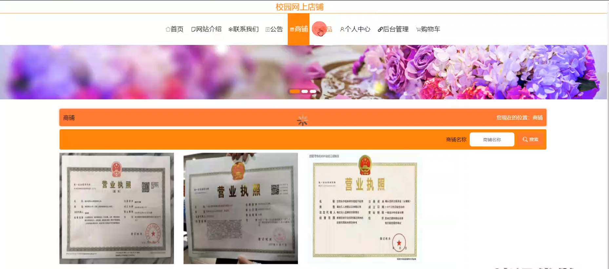

# 基于springboot的校园网上店铺

---
### 👉作者QQ ：1556708905 微信：zheng0123Long (支持定制修改、部署调试、定制毕设)

### 👉接网站建设、小程序、H5、APP、各种系统等

---

#### 介绍

在数字化时代，校园生活也逐渐与互联网深度融合。校园网上店铺作为校园电子商务的一种形式，为师生提供了便捷的购物体验。然而，现有的一些校园电商平台存在功能单一、用户体验不佳、管理不够精细等问题。
本基于 Spring Boot 的校园网上店铺系统旨在打造一个功能丰富、操作便捷、管理高效的校园购物平台，满足师生的多样化需求，促进校园商业的繁荣发展。

#### 技术栈

后端技术栈：Springboot+Mysql+Maven

前端技术栈：Vue+Html+Css+Javascript+ElementUI

开发工具：Idea+Vscode+Navicate

#### 系统功能介绍

（一）管理端  
个人中心：管理端人员可以在个人中心查看和修改个人信息，查看操作日志和系统通知。  
基础数据管理  
公告类型管理：定义不同类型的公告，如促销活动公告、新品上架公告、系统维护公告等，以便分类发布和管理。  
会员等级类型管理：设置会员等级，如普通会员、高级会员、VIP 会员等，并为不同等级设定相应的权益和优惠政策。  
商铺信用类型管理：评估商铺的信用等级，如优秀、良好、一般、较差等，依据信用等级对商铺进行监管和激励。  
商品类型管理：对商品进行分类，如食品、文具、服装、电子产品等，方便用户查找和筛选商品。  
公告管理：发布、编辑和删除公告，确保师生及时了解校园网上店铺的最新动态和重要信息。  
商铺管理：审核商铺的入驻申请，监督商铺的经营活动，对违规商铺进行处理。  
商品管理  
商品评价管理：查看和处理用户对商品的评价，及时了解商品的质量和用户满意度。  
商品收藏管理：了解用户对商品的收藏情况，分析热门收藏商品，为商铺提供市场需求参考。  
商品订单管理：处理商品订单，包括订单确认、发货、退款等操作，保障交易流程的顺利进行。  
单页数据管理：管理系统中的单页信息，如关于我们、帮助中心、隐私政策等页面的内容。  
用户管理：管理用户的注册信息、账户状态、消费记录等，保障用户信息的安全和系统的正常运行。  
轮播图信息：设置首页的轮播图，展示热门商品、促销活动、校园特色商品等，吸引用户的注意力。  

（二）商铺端  
网站介绍：展示商铺的基本信息、经营理念和特色服务。  
联系我们：提供商铺的联系方式，方便用户与商铺进行沟通。    
公告：发布商铺的专属公告，如促销活动、新品上架、店铺活动等。  
商铺：展示商铺的整体形象和品牌特色。  
商品：上架和管理商品，包括商品的信息录入、库存管理、价格调整等。  
个人中心：修改商铺信息、查看订单记录、管理商品评价等。  
后台管理  
公告管理：编辑和删除自己发布的公告。  
商品管理  
商品评价管理：回复用户对商品的评价，与用户进行互动。  
商品收藏管理：了解商品被收藏的情况，分析热门商品趋势。  
商品订单管理：处理商品订单，查看订单状态，安排发货等。  
购物车：查看用户添加到购物车但未结算的商品。  
 
（三）用户端  
网站介绍：了解校园网上店铺系统的基本情况和服务宗旨。  
联系我们：获取系统的联系方式，以便在遇到问题时进行咨询和反馈。  
公告：查看系统和商铺发布的公告，及时了解优惠活动和重要通知。  
商铺：浏览不同的商铺，了解其商品和服务。  
商品：搜索和筛选感兴趣的商品，查看商品详情和用户评价。  
个人中心：管理个人信息、收货地址、订单记录、收藏的商品等。  
后台管理  
公告管理：查看系统和关注商铺发布的公告历史记录。  
商品管理  
商品评价管理：对购买的商品进行评价和晒单。  
商品收藏管理：管理收藏的商品，方便快速找到心仪商品。  
商品订单管理：查看订单详情，跟踪订单状态，进行退款、退货等操作。  
购物车：将心仪的商品加入购物车，进行结算和支付。  

#### 系统作用

方便师生购物  
提供便捷的在线购物渠道，节省师生的时间和精力。  

促进校园商业发展  
为校园商铺提供线上销售平台，拓展业务范围，增加收入。  

提升管理效率  
帮助管理端实现对校园网上店铺的有效监管和资源优化配置。  

增强用户互动  
通过商品评价、收藏等功能，促进用户与商铺之间的交流和互动。  

丰富校园生活  
为校园生活增添更多的商业元素和便利服务。  

#### 系统功能截图

代码结构

数据库表

登录

前台页面首页

网站介绍

公告信息

商品信息

购物车

商铺

个人中心

管理员端基础数据管理

公告管理

商品管理

单页数据管理

用户管理

商铺端后台管理

商品订单管理

用户端后台管理

#### 总结

基于 Spring Boot 的校园网上店铺系统为校园电子商务提供了一体化的解决方案。然而，系统在实际运行中可能存在一些不足之处，如对高并发访问的处理能力有待提高、个性化推荐功能不够精准、与校园其他系统的集成存在一定难度等。未来，我们将持续优化系统性能，完善功能，提升用户体验，更好地服务于校园师生，推动校园电子商务的健康发展。

#### 使用说明

创建数据库，执行数据库脚本 修改jdbc数据库连接参数 下载安装maven依赖jar 启动idea中的springboot项目

前台登录页面
http://localhost:8080/xiaoyuanwangshangshangpu/front/index.html

后台登录页面
http://localhost:8080/xiaoyuanwangshangshangpu/admin/dist/index.html

管理员				账户:admin 		密码：admin

商铺				账户:a1 		密码：123456

用户				账户:a1 		密码：123456